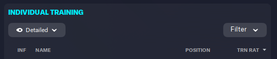

# FM23 Auto Praise Players Training

Automates praising players who train well in Football Manager 23.
No more manually checking training scores: this program detects when FM23 is running and automatically praises players with a training score of 7.50 or higher.

Table of Contents

- [FM23 Auto Praise Players Training](#fm23-auto-praise-players-training)
  - [Description](#description)
  - [Features](#features)
  - [Installation](#installation)
    - [Windows](#windows)
    - [Mac/Linux](#maclinux)
  - [Configuration](#configuration)
  - [Usage](#usage)
    - [Notes](#notes)
    - [Important](#important)
  - [Project Structure](#project-structure)
  - [Contributing](#contributing)
  - [License](#license)

## Description

This project is an automation script that interacts with Football Manager 23.

- Detects if FM23 is running.
- Navigates to the individual training section.
- Prints the screen in HTML format.
- Checks the training scores of your players.
- Automatically praises players with a performance score ≥ 7.50.

Goal: save time and keep your players motivated without manual effort.

## Features

- Multiplatform: Works on **Windows, macOS, and Linux (X11)**.
- Modular: Separate modules for **window detection**, **focus**, and **player interaction**.
- Configurable: Users can set **hotkeys** and **minimum score to praise** in `config.json`.
- Safe: Prevents accidental keypresses in other windows.

## Installation

1. Clone the repository:
   git clone <https://github.com/your_username/FM23-Auto-Praise-Players-Training.git>
   cd FM23-Auto-Praise-Players-Training

2. Create and activate a virtual environment:
   python -m venv venv

   ### Windows

   venv\Scripts\activate

   ### Mac/Linux

   source venv/bin/activate

3. Install dependencies (to be defined as the project progresses):
   pip install -r requirements.txt

Note: The project is in its early stages, so dependencies will be added as development continues.

## Configuration

Edit config.json to set:

```json
{
  "training_section_hotkey": "ctrl+u", // Whatever hotkey you use to navigate to the individual training section in FM
  "other_section_hotkey": "F4", // Hotkey to a section of the game that loads fast (inbox is F4 by default)
  "print_screen_hotkey": "ctrl+p", // In game hotkey to print the screen
  "print_dir": "~/Documents/Sports Interactive/Football Manager 2023", // The default directory shown when trying to print. If the Player file is not read correctly, try changing thi to wherever your game saves prints by default.
  "print_file_name": "Untitled.html", // Default name of a fresh screen print that the game sets
  "min_score_to_praise": 7.5, // The minimum training score to praise a player
  "delay_after_hotkey_in_seconds": 1 // The max amount of time (in seconds) your game takes to load the individual training screen
}
```

## Usage

Run the main script while FM23 is open:

```bash
   python main.py
```

Behavior:

1. Checks if FM23 is running.
2. Brings the FM23 window to focus.
3. Navigates to the training section using the hotkey.
4. Prints the individual training section in HTML using the in game print screen.
5. Recognizes the players and its rating (even if they're not visible because of scroll).
6. Praises players with score ≥ threshold every few seconds.
7. It is recommended to keep FM23 running in the background while the script executes.

### Notes

- Make sure FM23 is running before starting the script.
- This script is tested using the Football Manager screen in a 1920x1080 monitor, with game windowed anf fullscreen. Other conditions may not work.
- Ensure the hotkey in config.json matches your FM23 configuration.
- Multiplatform solution uses pygetwindow + pyautogui, no platform-specific dependencies.
- For best results, run the script in a windowed environment (not minimized or full-screen exclusive).

### Important

- Make sure the individual training screen options are set to "Detailed" and the list of players is ordered by "Training Rating" as shown in the screenshot:


## Project Structure

```bash
FM23-Auto-Praise-Players-Training/
├── main.py                  # Main loop
├── fm_running.py            # Detects FM23 process
├── focus_fm.py              # Brings FM23 window to front and navigates
├── nav_to_training.py       # Navigate to the individual training section on FM23
├── utils.py                 # Multi-purpose functions
├── print_screen.py          # Takes an html screenshot of FM (native from the game)
├── player_identifier.py     # Uses the screen printed in HTML to get the training info of players
├── config.json              # User settings (hotkeys, thresholds)
├── requirements.txt
├── README.md
└── .gitignore
```

## Contributing

1. Fork the project
2. Create a branch: git checkout -b my-new-feature
3. Commit your changes: git commit -m "Add new feature"
4. Push to the branch: git push origin my-new-feature
5. Open a Pull Request

## License

MIT License
